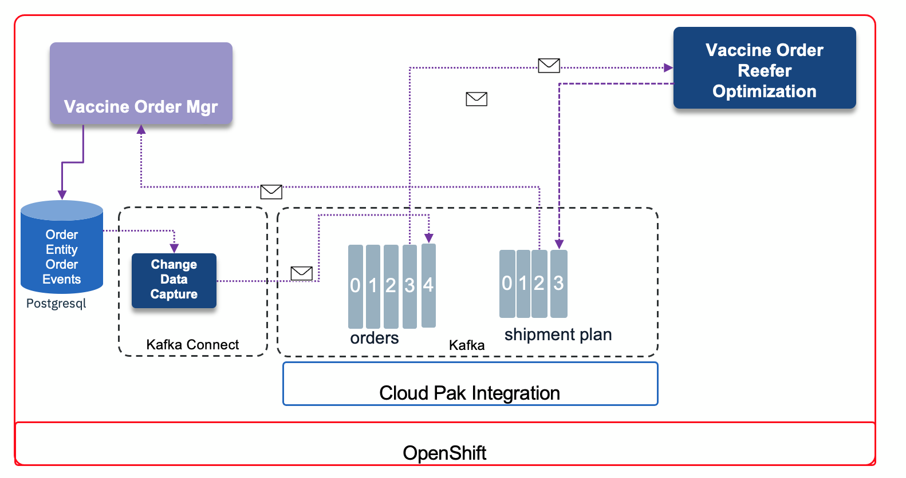

# Vaccine Order Manager event-driven microservice

This service is responsible to manage the Vaccine Order entity using the transactional outbox pattern. It is done with Smallrye microprofile, Quarkus, reactive messaging using Kafka, Debezium outbox extension and change data capture, hibernate ORM with panache for Posgresql database, and git action pipeline.

Visit detail implementation approach, design and different deployment model, read explanations of this service in [the main solution documentation](https://ibm-cloud-architecture.github.io/vaccine-solution-main/solution/orderms/).

The goals of this project are to present:

* a Quarkus app with the [Debezium outbox](https://debezium.io/documentation/reference/integrations/outbox.html) extension to create events in the same transaction as writing the business entity within Postgresql
* the Reactive RESTs API with Mutiny and JAXRS
* the JPA with Hibernate and Panache implementation for Postgresql database
* Debezium Postgres [Change Data Capture connector](https://debezium.io/documentation/reference/connectors/postgresql.html) to publish OrderEvents to Kafka topic
* Consume ShipmentPlan from Kafka using reactive messaging

This service integrates with Kafka and may be completed with the order optimization service to demonstrate the vaccine order fulfillment use case. 

 

## Pre-requisites

Be sure to have a Kafka cluster deployed with the topics defined. This can be done using the [vaccine-gitops](https://github.com/ibm-cloud-architecture/vaccine-gitops) repository where dependent components such as Kafka and Postgresql are defined as code, and the order management microservice deployment config yaml files are also defined in this gitops project.

[order-mgt-deployconfig.yaml](https://github.com/ibm-cloud-architecture/vaccine-gitops/blob/main/environments/dev/apps/order-mgt/base/order-mgt-deployconfig.yaml)

## Build 

### Source to image

The application uses Quarkus OpenShift extension to create yaml files for OpenShift and deploy the application using source to image capability of OpenShift. The following command will build the Vuejs UI, the quarkus app and then perform a source to image so the service will be deployed as pod inside OpenShift. 

```shell
# You need to be connected to the OpenShift Cluster.
./mvnw clean package -Dui.deps -Dui.dev -Dquarkus.kubernetes.deploy=true -DskipTests
```

The `-Dui.deps -Dui.dev` arguments are used to prepare and build the vue.js app from the `ui` folder. The packaging builds a runner jar and pushes it to the private image registry in OpenShift.

Be sure to get the Order Microservice URL to access the user interface, using `oc get routes` on the project.

### Dockerize

```shell
mvn clean package -Dui.dev -Dui.deps -DskipTests
docker build -f src/main/docker/Dockerfile.jvm -t ibmcase/vaccineorderms:0.0.2 .
docker push ibmcase/vaccineorderms:0.0.2
```

## Run locally

### For demo purpose

If you want to develop from existing code, running: `mvn quarkus:dev` will start the app but you need to get access to a postgresql database and Kafka. So for that we have integrated a docker compose file.

The `environment/docker-compose.yaml` docker compose starts postgresql, kafka, zookeeper, and the orderms connected to the local docker network called `app-tier`

```shell
 # Start local environment 
 cd environment
 docker-compose -f docker-compose.yaml up -d 
 ```

* Verify the Kafka topics

Some topics are created by the Kafka Connector.

```shell
# validate topics created
./listTopics.sh
# __consumer_offsets
# vaccine_shipment_plans
```


### UI development

For UI development start the components with `docker-compose  -f dev-docker-compose.yaml up -d`, then under the ui folder, do the following:

```
yarn install
yarn serve
```

Use the web browser and developer console to the address [http://localhost:4545](http://localhost:4545). The Vue app is configured to proxy to `localhost:8080`.


### Git Action

This repository includes a Github [workflow](https://github.com/ibm-cloud-architecture/vaccine-order-mgr/blob/master/.github/workflows/dockerbuild.yaml) to build the app and push a new docker image to the public registry. To do that we need to define four secrets in the github repository:

* DOCKER_IMAGE_NAME the image name to build. Here it is `vaccineorderms`
* DOCKER_USERNANE: user to access docker hub
* DOCKER_PASSWORD: and its password.
* DOCKER_REPOSITORY for example the organization we use is `ibmcase`

## With remote Kafka and Postgresql

Using the [gitops repository](https://github.com/ibm-cloud-architecture/vaccine-gitops) we can have an OpenShift project created and then Postgresql and Kafka deployed.


* If not done before, copy the cluster certificate via the secret to your project (`vaccine`):

 ```shell
 oc get secret eda-dev-cluster-ca-cert -n eventstreams --export -o yaml | oc apply -f -
 ```


### Run with remote services

It is possible to run the quarkus app to connect to the Postgres local and Kafka deployed on OpenShift.

Set the following environment variables in a `.env` file, and get the truststore.p12 file from the Kafka configuration

 ```shell
 export QUARKUS_DATASOURCE_USERNAME=postgres
 export QUARKUS_DATASOURCE_PASSWORD=<>
 export POSTGRESQL_DBNAME=postgres
 export QUARKUS_DATASOURCE_JDBC_URL=jdbc:postgresql://localhost:15432/postgres
 export KAFKA_USER=<user with scram>
 export KAFKA_PASSWORD=<user psw>
 export KAFKA_BOOTSTRAP_SERVERS=<url bootstratp>.us-east.containers.appdomain.cloud:443
 export KAFKA_SSL_TRUSTSTORE_LOCATION=${PWD}/truststore.p12
 export KAFKA_SSL_TRUSTSTORE_PASSWORD=<pwd of the truststore> 
 ```

 ```shell
 # be sure to have packaged the order app first with the following command which also builds the UI
 source .env
 ./mvnw package -Dui.deps -Dui.dev -DskipTests
 # If the UI does not need to be built again just do:
 ./mvnw quarkus:dev 
 ```


## Demonstration

See the script in [this section](https://ibm-cloud-architecture.github.io/vaccine-solution-main/solution/orderms/#demonstration-script).


## Debezium CDC connector

The [Debezium Postgres connector](https://debezium.io/documentation/reference/connectors/postgresql.html) is a Kafka Connector. So to deploy to Event Streams or Strimzi Connector we will use source to image approach.

* From the Event Streams UI > Toolbox > Kafka Connect menu, download the source to image yaml file.
* Modify the file to get connection to the Kafka brokers
* Add declaration to use Postgres connector
* Deploy with `oc apply -f environment/cdc/kafka-connect-s2i.yaml`


* Start a consumer on the CDC topic for the order events

 ```shell
 docker-compose exec kafka /opt/kafka/bin/kafka-console-consumer.sh     --bootstrap-server kafka:9092     --from-beginning     --property print.key=true     --topic ...
 ```

* Add new order from the user interface: http://localhost:8080/#/Orders, or...

* Post an order using the API: [http://localhost:8080/swagger-ui/#/default/post_orders](http://localhost:8080/swagger-ui/#/default/post_orders). Use the following JSON

 ```json
 {
    "deliveryDate": "2021-07-25",
    "deliveryLocation": "Milano",
    "askingOrganization": "Italy gov",
    "priority": 1,
    "quantity": 100,
    "type": "COVID-19"
 }
 ```

 * The expected result should have the following records in the Kafka topic:

 ```json
 {"ID":"lvz4gYs/Q+aSqKmWjVGMXg=="}	
 {"before":null,"after":{"ID":"lvz4gYs/Q+aSqKmWjVGMXg==","AGGREGATETYPE":"VaccineOrderEntity","AGGREGATEID":"21","TYPE":"OrderCreated","TIMESTAMP":1605304440331350,"PAYLOAD":"{\"orderID\":21,\"deliveryLocation\":\"London\",\"quantity\":150,\"priority\":2,\"deliveryDate\":\"2020-12-25\",\"askingOrganization\":\"UK Governement\",\"vaccineType\":\"COVID-19\",\"status\":\"OPEN\",\"creationDate\":\"13-Nov-2020 21:54:00\"}"},"source":{"version":"1.3.0.Final","connector":"db2","name":"vaccine_lot_db","ts_ms":1605304806596,"snapshot":"last","db":"TESTDB","schema":"DB2INST1","table":"ORDEREVENTS","change_lsn":null,"commit_lsn":"00000000:0000150f:0000000000048fca"},"op":"r","ts_ms":1605304806600,"transaction":null}
 ```
